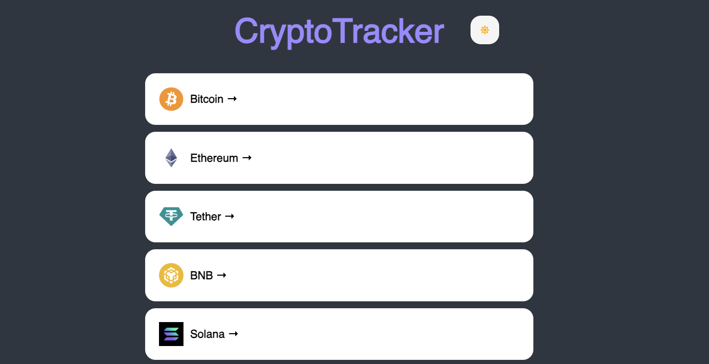
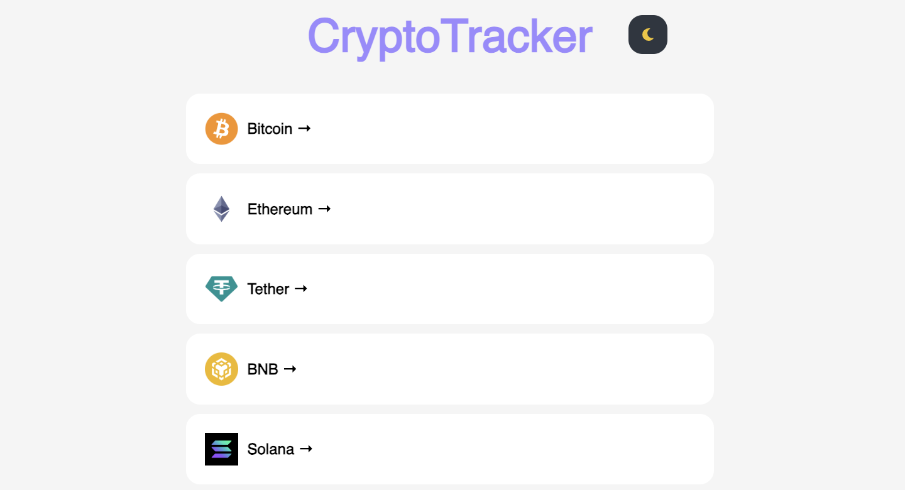
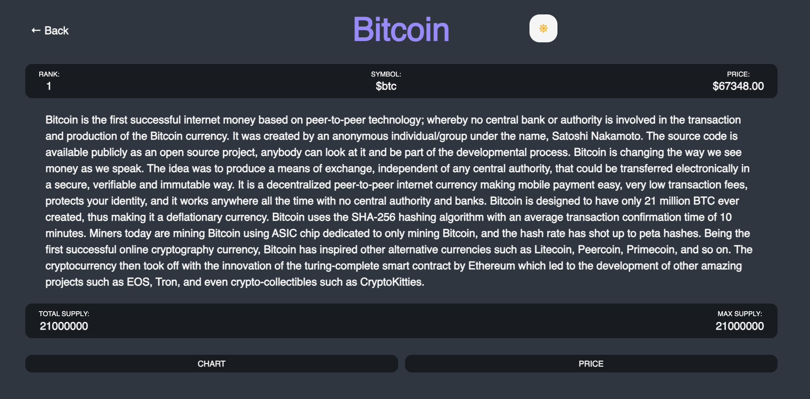
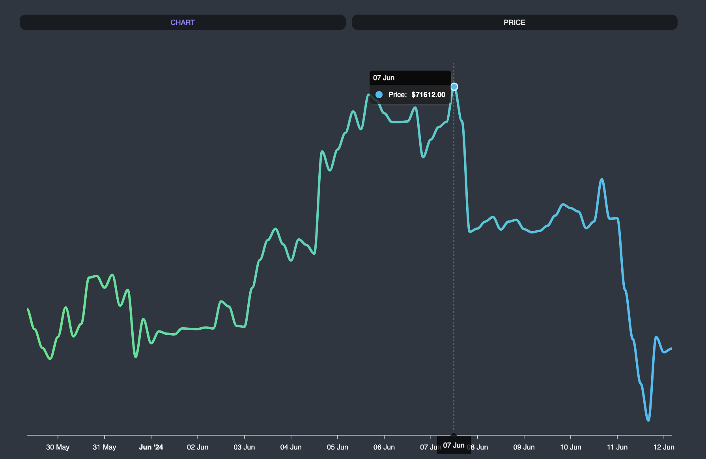
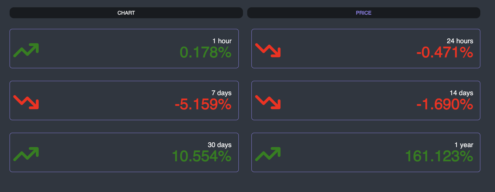

# CryptoTracker

## Overview
CryptoTracker is a dynamic web application designed to provide real-time cryptocurrency data. Leveraging the CoinGecko API, this tool displays detailed price trends and information for various cryptocurrencies, making it an essential utility for crypto enthusiasts and investors who need to track market movements efficiently.

## Main Page (Dark Mode)

## Main Page (Light Mode)

## Coin Page

## Price Trend Chart

## Price Info

## Functionality
- **Real-Time Price Updates:** Live price tracking of various cryptocurrencies.
- **Historical Data Trends:** Visual charts that display historical price movements, offering users a comprehensive view of market trends over time.
- **User-Friendly Interface:** An intuitive user interface that makes navigation and usage straightforward for all users.
- **Dark/Light Mode Toggle:** Allows users to switch between dark and light modes for a better visual experience.

## Technologies Used
- **React & TypeScript:** Used for building a robust and scalable frontend.
- **React Query:** Employed to handle API calls and data fetching, ensuring efficient data synchronization and state management.
- **Styled Components:** Provides clean and reusable styling within React components, enhancing the UI's maintainability.
- **React Router:** Manages navigation within the application, enabling a seamless single-page application experience without page reloads.
- **ApexCharts:** Integrated for rendering sophisticated and interactive charts, crucial for visualizing price trends effectively.
- **Recoil:** Utilized for state management, specifically to handle the dark/light mode toggle globally.